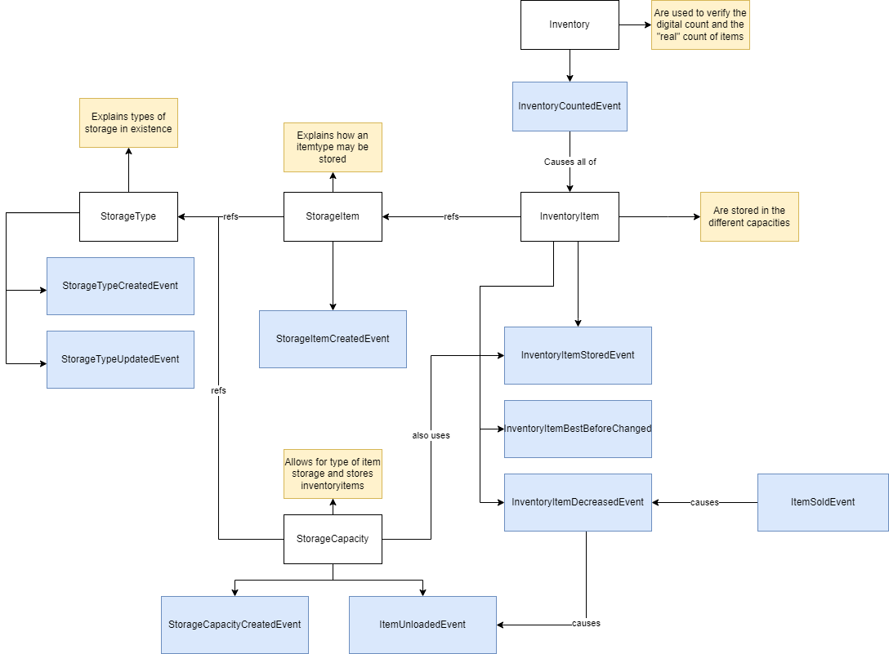

# Inventorymanagement Application
Currently running on gradle with Spring Boot and Hash Repositories. Testing remains.... experimental.
But damn look at the quota of test code and coverage thats some tight domain!

## Overview

